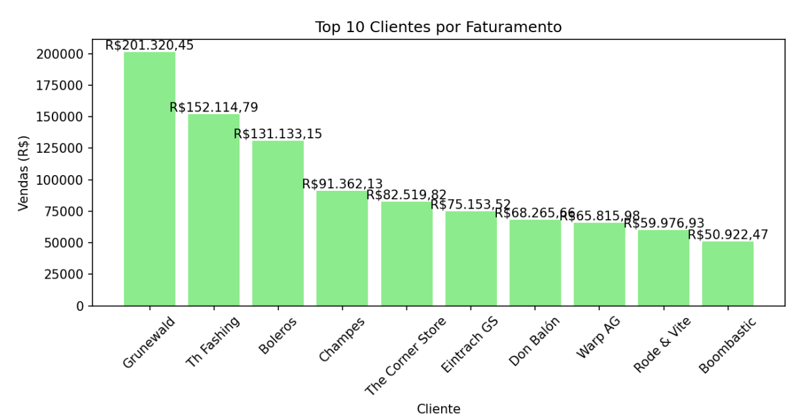
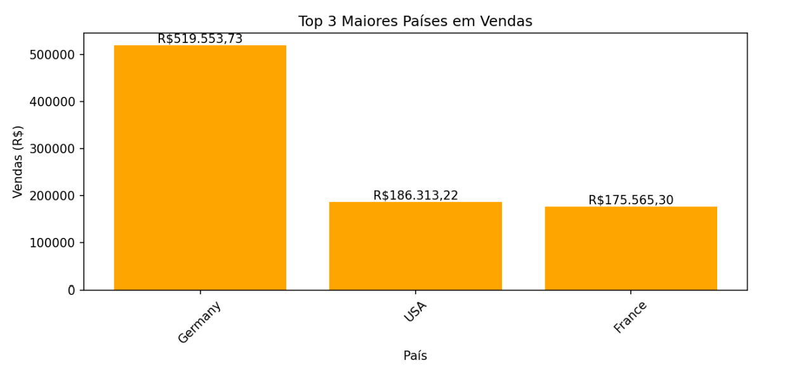
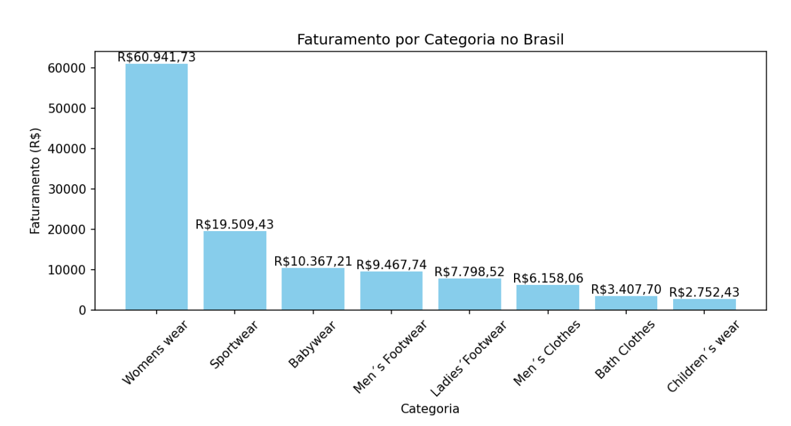
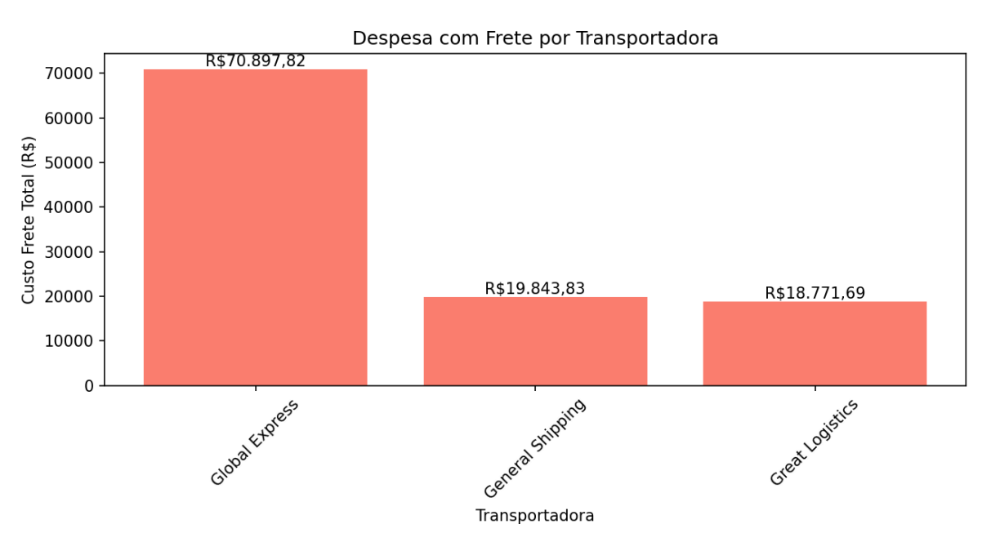
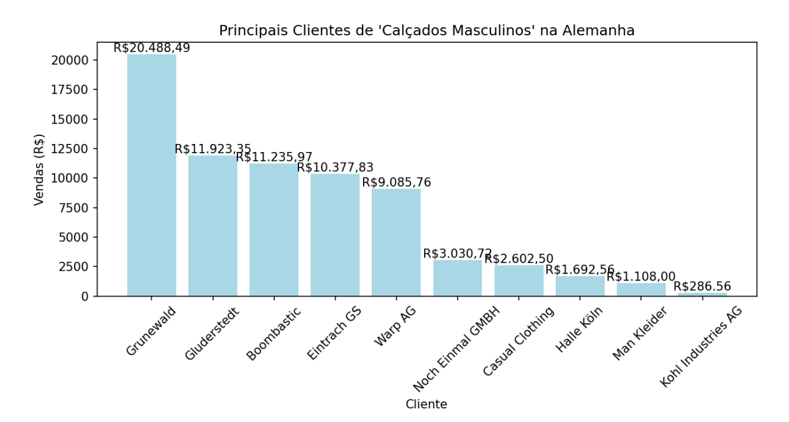
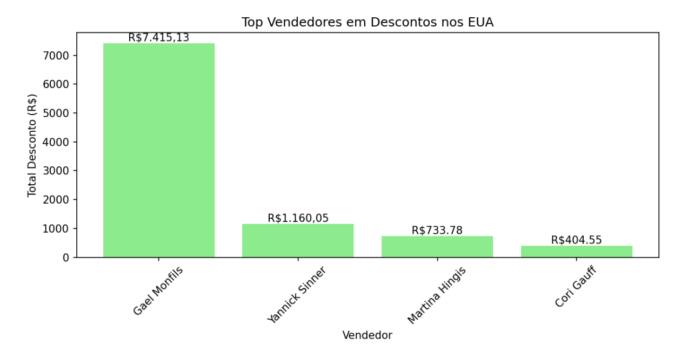
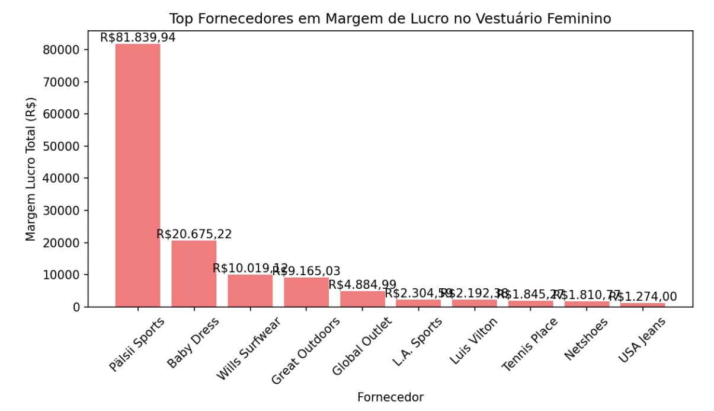
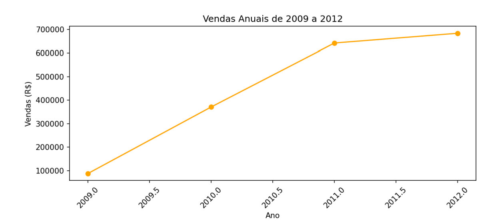
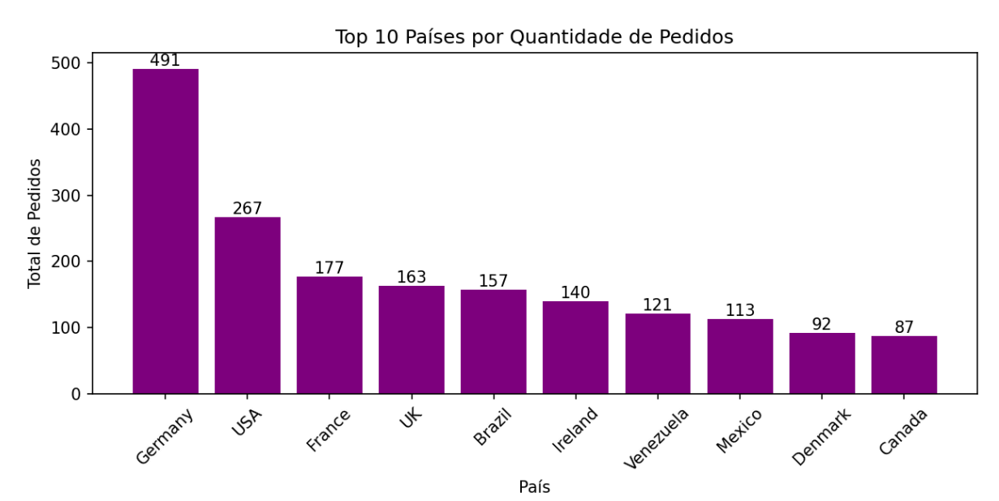

# 1. Introdução

**Objetivo:** Este documento tem como objetivo apresentar os resultados de um departamento de vendas, e como eles foram obtidos.

**Escopo:** Resumo dos temas abordados, incluindo as perguntas respondidas, as estratégias e tecnologias usadas, e a análise do tempo gasto.

## 1.2 Tecnologias Utilizadas

Uma das principais prioridades foi optar por ferramentas amplamente compreendidas pelo time, permitindo uma curva de aprendizado reduzida e maior eficiência no processo de desenvolvimento. Além disso, a escolha por soluções de código aberto contribuiu para reduzir custos, viabilizando o projeto de forma mais econômica.

- **GitHub:** Controle de versionamento.
- **Python:** Linguagem de programação.
- **Pandas:** Manipulação e análise dos dados.
- **Matplotlib:** Visualização de dados em gráficos.
- **Chat GPT:** Análises e dicas a partir dos dados obtidos pela equipe.

# 2. Respostas às Perguntas

### Pergunta 1: Quem são os meus 10 maiores clientes, em termos de vendas ($)?

Os 10 maiores clientes, em termos de vendas, são liderados por Grunewald, com R$201,320.45, seguido por Th Fashing (R$152,114.79) e Boleros (R$131,133.15). Estes três clientes representam volumes de venda significativamente maiores, indicando uma concentração nas receitas.

### Pergunta 2: Quais os três maiores países, em termos de vendas ($)?

Os três maiores países em termos de vendas são:
- **Alemanha:** $519,553.73, destacando-se como o principal mercado.
- **Estados Unidos:** $186,313.22.
- **França:** $175,565.30, próximo ao volume de vendas dos EUA.

### Pergunta 3: Quais as categorias de produtos que geram maior faturamento (vendas $) no Brasil?

No Brasil, as categorias de produtos que geram maior faturamento são:
- **Women's Wear:** $60,941.73.
- **Sportswear:** $19,509.43.
- **Babywear:** $10,367.21.

### Pergunta 4: Qual a despesa com frete envolvendo cada transportadora?

A transportadora com maior gasto total é a **Global Express** (R$70,897.82), seguida por **General Shipping** (R$19,843.83) e **Great Logistics** (R$18,771.69). Essa disparidade pode indicar uma dependência da Global Express ou uma operação mais extensa com ela.

### Pergunta 5: Quais são os principais clientes (vendas $) do segmento “Calçados Masculinos” (Men's Footwear) na Alemanha?

No segmento "Calçados Masculinos" na Alemanha, o cliente **Grunewald** lidera as vendas com R$20,488.49, seguido por **Gluderstedt** (R$11,923.35) e **Boombastic** (R$11,235.97). Esses três clientes representam as maiores contribuições de vendas.

### Pergunta 6: Quais os vendedores que mais dão descontos nos Estados Unidos?

O vendedor **Gael Monfils** lidera em descontos nos Estados Unidos com R$7,415.13, seguido por **Yannick Sinner** (R$1,160.05) e **Martina Hingis** (R$733.78).

### Pergunta 7: Quais os fornecedores que dão a maior margem de lucro ($) no segmento de “Vestuário Feminino” (Women's Wear)?

O fornecedor **Pälsii Sports** proporciona a maior margem de lucro com R$81,839.94, seguido por **Baby Dress** (R$20,675.22) e **Wills Surfwear** (R$10,019.12).

### Pergunta 8: Quanto foi vendido ($) no ano de 2009? Observando as vendas anuais entre 2009 e 2012, concluímos que o faturamento vem crescendo?

Em 2009, o total de vendas foi de R$87,666.29. Observa-se um aumento significativo até 2012, com as vendas atingindo R$682,973.44, indicando uma expansão constante.

### Pergunta 9: Questão já respondida na questão 5!

### Pergunta 10: Quais os países com maior quantidade total de pedidos?

A Alemanha lidera com 491 pedidos, seguida pelos Estados Unidos (267) e pela França (177). Estes números mostram uma concentração em países europeus.

# 3. Estratégia 

  ## Estratégia de Abordagem

### Análise e Agrupamento de Dados:

Para cada questão, começamos por identificar as colunas relevantes nas tabelas de dados (`vendas_globais`, `fornecedores`, `transportadoras` e `vendedores`). Em seguida, realizamos o agrupamento e a agregação dos dados com base nas variáveis pertinentes (por exemplo, `ClienteNome`, `ClientePaís`, `CategoriaNome`, etc.).

- Para identificar os maiores clientes, países e categorias, utilizamos agregações com `.groupby()` e `.sum()`, ordenando em ordem decrescente e extraindo os maiores valores com `.nlargest()`.

### Filtragem e Segmentação de Dados:

Para questões que requerem filtros específicos, como identificar vendas de determinados segmentos em países específicos (por exemplo, "Calçados Masculinos" na Alemanha), aplicamos condições lógicas sobre os dados, selecionando as linhas que atendem aos critérios especificados.

### Visualização dos Resultados:

Para melhorar a compreensão dos resultados, criamos gráficos de barras com o Matplotlib. Esses gráficos ajudam a visualizar os maiores valores por categoria, país, cliente ou fornecedor. Para cada gráfico, adicionamos rótulos detalhados e formatamos os valores monetários, facilitando a leitura dos dados.

### Frameworks e Bibliotecas Utilizadas:

Utilizamos o **Pandas** para manipulação e agregação dos dados, e o **Matplotlib** para gerar visualizações. Essas ferramentas são eficazes para análise de dados de vendas e permitem uma resposta objetiva e detalhada às perguntas propostas.

# 4. Análise do Tempo Gasto

- **Análise dos Requisitos:** 
  - 13 minutos 

- **Preparação da Infraestrutura:** 
  - 20 minutos 

- **Implementação da Solução:**
  - 1 hora 20 minutos

- **Criação dos gráficos**
  - 15 minutos

- **Revisão e conteúdo para aprensentação**
  - 30 minutos
- **Total de Horas:** 2 hora e 38 minutos

# 5. Conclusão

- **Resultados Obtidos:**
 - Este projeto atingiu seu objetivo de analisar dados de vendas e responder a perguntas-chave sobre o desempenho do negócio. Através do uso combinado de Python, Pandas e Matplotlib, foi possível extrair informações relevantes sobre os maiores clientes, países com maior faturamento, categorias de produtos mais vendidas, custos de frete, descontos aplicados por vendedores, margens de lucro de fornecedores e tendências de vendas ao longo do tempo. A visualização dos dados em gráficos de barras facilitou a compreensão e comunicação dos resultados, permitindo uma análise mais clara e objetiva.

-  A estratégia adotada de análise, agrupamento, filtragem e visualização de dados, apoiada pelas bibliotecas Pandas e Matplotlib, mostrou-se eficaz na extração e apresentação das informações solicitadas. A utilização de ferramentas open-source, como Python e suas bibliotecas, contribuiu para a redução de custos no projeto. A metodologia aplicada permitiu responder às perguntas de negócio de forma eficiente, dentro de um prazo razoável, demonstrando o potencial da análise de dados para a tomada de decisões estratégicas. A identificação dos principais clientes, mercados e produtos de maior rentabilidade fornece insights valiosos para direcionar esforços de marketing e vendas, otimizar a logística e negociar melhores condições com fornecedores.

# Equipe

    <a href="https://github.com/aliclic">
        
        <strong>Alic Victor</strong> 
    </a>
    <a href="https://github.com/julianafer">
        
        <strong>Juliana Ferreira</strong>
    </a>
    <a href="https://github.com/ImMarcio">
        
        <strong>Márcio José</strong> 
    </a>
    <a href="https://github.com/RicardoLuiz05">
        
        <strong>Ricardo Luiz</strong> 
    </a>

